# Wokwi Vision Studio — Virtual ESP32-CAM HD Streamer & 3rd-Party Bridge

Giải pháp thay thế hoàn hảo cho phần cứng **ESP32-CAM**: Sử dụng Webcam máy tính (Local) đóng vai trò là **Cảm biến Camera thực (Virtual OV2640 Sensor)**, truyền luồng ảnh màu chất lượng cao (**Full Color JPEG VGA 640x480 / QVGA 320x240 / HD 720p**) qua **Wokwi ESP32**, và chuyển tiếp (Relay) cho **Web thứ 3**, **Hệ thống AI (Python OpenCV / YOLO)** hoặc Dashboard IoT sử dụng.

---

## 🌟 Kiến trúc giải pháp (Architecture)

```mermaid
graph LR
    subgraph Local ["🌐 1. Local Webcam Studio (Virtual OV2640 Sensor)"]
        Cam[Local HD Webcam] --> Canvas[Full-Color HD Frame]
        Canvas --> JPEG["JPEG Encoder (Quality 80%)"]
        JPEG --> WSS["MQTT WebSocket (Input Topic)"]
    end

    subgraph Wokwi ["⚡ 2. Wokwi ESP32-CAM Firmware"]
        WSS --> ESP32["ESP32 FrameBuffer (camera_fb_t)"]
        ESP32 --> Relay["High-Speed Relay Forwarder"]
        Relay --> OutputTopic["MQTT Output Topic: /output_jpeg"]
    end

    subgraph ThirdParty ["🚀 3. Web thứ 3 / AI App / IoT Dashboard"]
        OutputTopic --> Client3rd["3rd-Party HTML/JS Web / Python OpenCV / AI"]
        Client3rd --> Display["📺 Hiển thị ảnh Full Color nguyên bản 100%"]
    end
```



---

## 📁 Danh sách tệp dự án

```text
webcam-wokwi-streamer/
├── index.html                       # Giao diện Studio Dashboard (Cảm biến Camera giả lập)
├── style.css                        # Giao diện Cyber Dark Mode Glassmorphism
├── app.js                           # Logic bắt hình Webcam HD, nén JPEG & MQTT Client
├── third-party-client-example.html  # Trang Web thứ 3 mẫu nhận luồng từ Wokwi ESP32
├── third_party_python_opencv.py     # Script Python OpenCV nhận ảnh từ Wokwi cho AI
├── wokwi/                           # Mã nguồn mô phỏng Wokwi ESP32-CAM
│   ├── sketch.ino                   # Code C++ ESP32-CAM nhận và relay ảnh JPEG
│   ├── diagram.json                 # Sơ đồ mạch ESP32 + LCD1602 I2C
│   ├── libraries.txt                # Thư viện PubSubClient & LiquidCrystal I2C
│   └── README_WOKWI.md              # Hướng dẫn từng bước chạy trên Wokwi
└── README.md                        # Tài liệu hướng dẫn toàn diện
```

---

## 🚀 Hướng dẫn khởi chạy & Kết nối Web thứ 3

### Bước 1: Mở Web Studio
- Mở **[http://localhost:3000](http://localhost:3000)** (hoặc mở trực tiếp file `index.html`).
- Chọn độ phân giải (ví dụ: `VGA 640x480` hoặc `QVGA 320x240`), chỉnh chất lượng JPEG `80%`.
- Nhấn **Bật Webcam**.

### Bước 2: Chạy mô phỏng trên Wokwi
1. Mở [https://wokwi.com/projects/new/esp32](https://wokwi.com/projects/new/esp32).
2. Dán `sketch.ino`, `diagram.json`, và `libraries.txt` từ thư mục `wokwi/` vào Wokwi.
3. Nhấn nút **Play ▶️** trên Wokwi. Màn hình LCD sẽ báo `ESP32-CAM READY`.

### Bước 3: Bắt đầu Stream từ Web
- Quay lại Web Studio, nhấn nút **Stream to Wokwi**.

### Bước 4: Nhận hình ảnh trên Web thứ 3
- Mở file [third-party-client-example.html](file:///d:/New%20folder/webcam-wokwi-streamer/third-party-client-example.html) trong tab trình duyệt mới hoặc nhúng đoạn code JavaScript sau vào trang Web của bạn:

```html
<script src="https://unpkg.com/mqtt/dist/mqtt.min.js"></script>


<script>
  const client = mqtt.connect("wss://broker.hivemq.com:8884/mqtt");
  client.on("connect", () => {
    client.subscribe("wokwi/esp32cam/esp32cam_studio/output_jpeg");
  });
  client.on("message", (topic, payload) => {
    const blob = new Blob([payload], { type: "image/jpeg" });
    document.getElementById("myEsp32Cam").src = URL.createObjectURL(blob);
  });
</script>
```

---

## 🐍 Nhận hình ảnh trong Python (OpenCV / AI)

Chạy script Python để nhận ảnh từ Wokwi ESP32 phục vụ nhận diện khuôn mặt, YOLO, AI:
```bash
pip install paho-mqtt opencv-python numpy
python third_party_python_opencv.py
```
